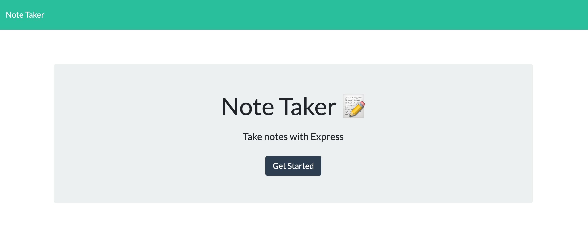

# My Notebook

## Description

My Notebook is a simple and lightweight note taking web application. Write and store notes with with full stack project.
 
Deployed at [https://my-notebook-dz.herokuapp.com/](https://my-notebook-dz.herokuapp.com/)

## Table of Contents

- [Installation](#installation)
- [Usage](#usage)
- [Questions](#questions)
- [Credits](#credits)
- [License](#license)

## Installation

My Notebook uses the following NPM packages:

- Express
- Jest
- UUID

 

> npm install

## Usage

## Questions

Please feel free to reach out to me on my [GitHub](https://github.com/dzamanillo).

You can also email me at dzamanillok@gmail.com

## Credits

Daniel Zamanillo

## License

None
